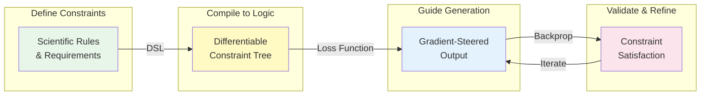
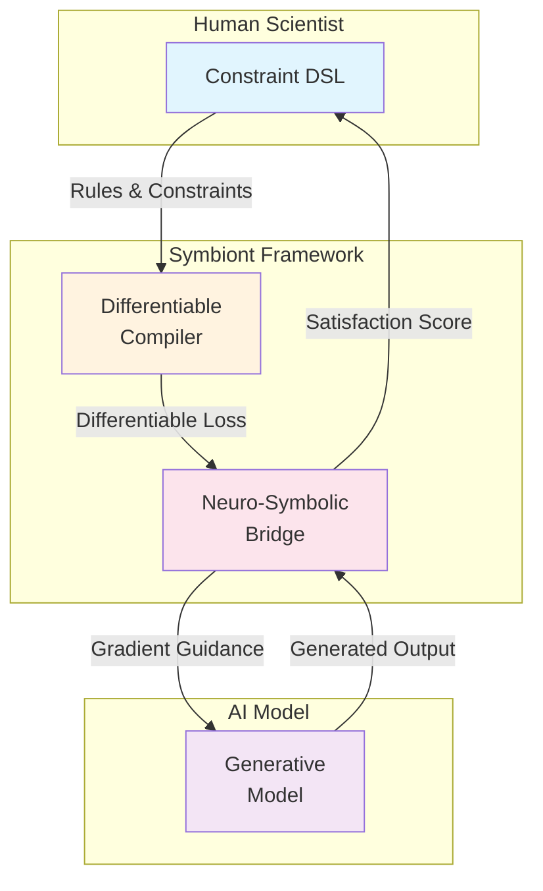
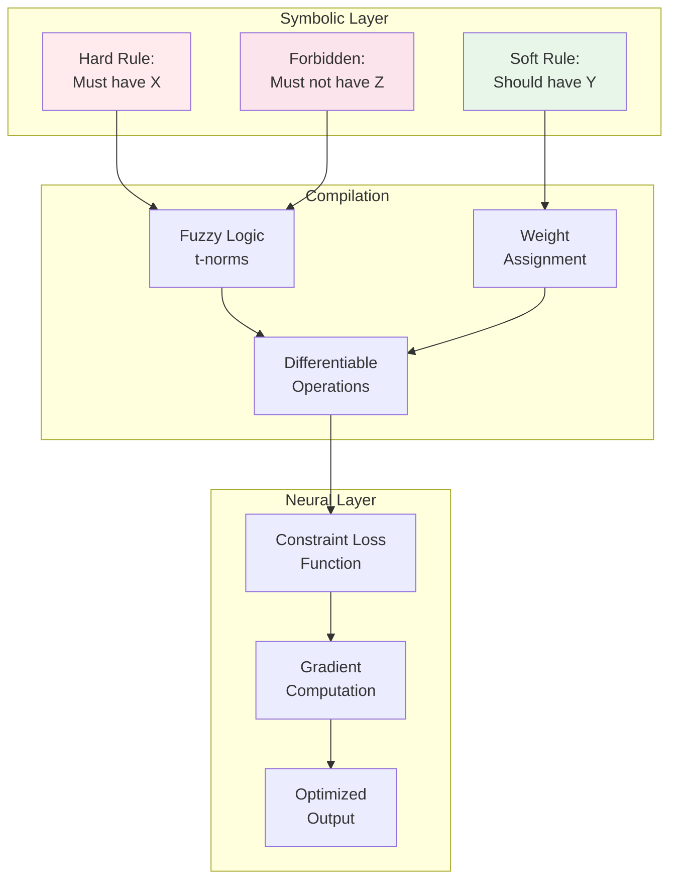

# Symbiont: Neuro-Symbolic Generation Framework

**Symbiont is an open-source, neuro-symbolic framework that fuses the creative power of generative AI with the structured, domain-specific knowledge of human scientists. It transforms generative AI from a blunt instrument into a precise, steerable partner, enabling a new era of co-creative scientific discovery.**

## Architecture Overview



### **The Problem: The Generative AI Impasse in R\&D**

Generative AI models have demonstrated a remarkable ability to create novel scientific designs, but their practical application is hampered by a critical flaw: a lack of **steerability and constraint adherence**.

* **The "Black Box" Problem:** Current models generate outputs probabilistically, with little to no control for the scientist beyond the initial prompt.
* **High Failure Rate:** This leads to a costly "generate-and-filter" workflow, where a majority of generated candidates are invalid, unstable, or physically impossible, wasting massive computational and experimental resources.
* **Untapped Human Expertise:** The invaluable, hard-won knowledge of domain scientists has no direct mechanism for influencing the AI's creative process.

This impasse is a major bottleneck, preventing generative AI from reaching its full potential as a transformative tool for science.

### **Our Solution: A Co-Creative Partnership**

Symbiont introduces a **neuro-symbolic architecture** that acts as an intelligent bridge between the human scientist and the generative AI. It allows scientists to define the non-negotiable rules, physical laws, and design principles of their domain as a **"symbolic scaffold."** The generative AI then explores the vast design space *within* those boundaries.

This transforms the workflow from "generate-and-filter" to **"guided-generation,"** ensuring every output is not just novel, but also valid, feasible, and aligned with the scientist's strategic goals.

### **How It Works**

Symbiont is composed of four key components that work in a continuous, interactive loop:



1. **The Generative Engine:** A pluggable backend for state-of-the-art generative models (Transformers, GNNs, Diffusion Models).
2. **The Symbolic Scaffolding Engine:** An intuitive Python DSL for scientists to declare rules and constraints in a human-readable format.
3. **The Neuro-Symbolic Bridge:** The core of the framework. It translates the symbolic rules into a differentiable loss function that can steer the generative model via backpropagation.
4. **The Interactive Discovery Dashboard:** A web-based UI for defining rules, visualizing results in real-time, and creating a rapid, iterative discovery loop.

For a complete technical breakdown, please see our full [**Project Vision Document**](/docs/project_vision.md). For the theoretical foundations and detailed framework design, see our [**Conceptual Paper**](/docs/white-papers/symbiont_conceptual_paper.pdf).

### **Getting Started**

*(This section will be updated as the project matures.)*

To get started with Symbiont, you will need Python 3.9+ and PyTorch.

1. Clone the repository:
   ```bash
   git clone https://github.com/dilee/symbiont-core.git
   cd symbiont-core
   ```

2. Install the required dependencies:
   ```bash
   poetry install
   ```

3. Run the example script:
   ```bash
   poetry run python examples/toy_sequence.py
   ```

### **Example Usage**

```python
from symbiont import Rules, MockSequenceGenerator

# Define constraints using intuitive DSL
rules = Rules()
rules.enforce(StartCodon())              # Must start with ATG
rules.constrain(GCContent(0.4, 0.6))     # GC content between 40-60%
rules.forbid(Contains("AAAA"))           # No poly-A sequences
rules.prefer(Contains("GAATTC"))         # Prefer EcoRI site

# Generate with constraints
generator = MockSequenceGenerator()
sequence = generator.constrained_generate(
    rules.compile(),
    length=100
)
```

### **Constraint Compilation Process**



### **Documentation**

- [**Conceptual Paper**](/docs/white-papers/symbiont_conceptual_paper.pdf) - Theoretical foundations and framework design
- [**Project Vision**](/docs/project_vision.md) - Long-term vision and strategic direction
- [**Development Roadmap**](/ROADMAP.md) - Phased development plan from prototype to production

### **How to Contribute**

We are actively looking for collaborators\! Symbiont is an ambitious project, and its success depends on a diverse community of contributors. Whether you are an AI developer, a software engineer, a domain scientist, or a technical writer, there is a place for you here.

Please read our [**CONTRIBUTING.md**](/CONTRIBUTING.md) file to learn about our development process, roadmap, and how you can get involved.

### **License**

This project is licensed under the MIT License. See the [LICENSE](/LICENSE) file for details.
